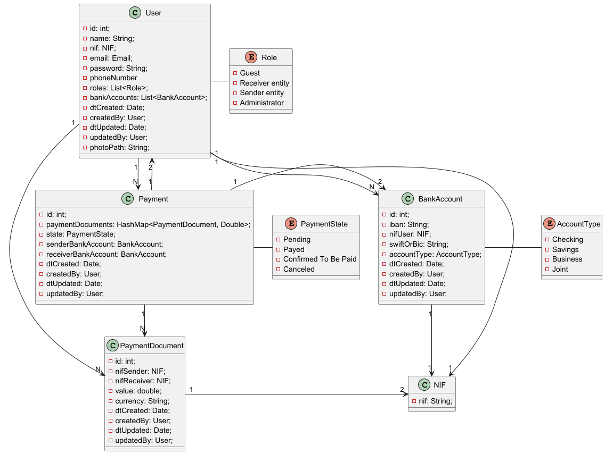
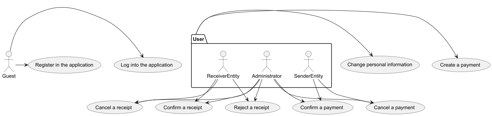
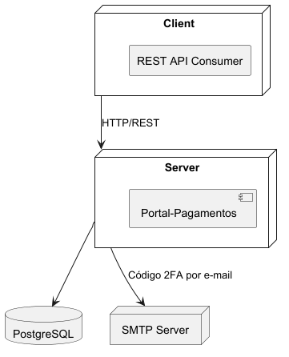
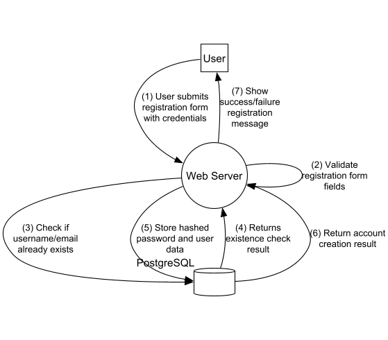
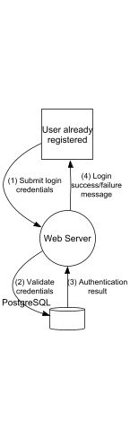
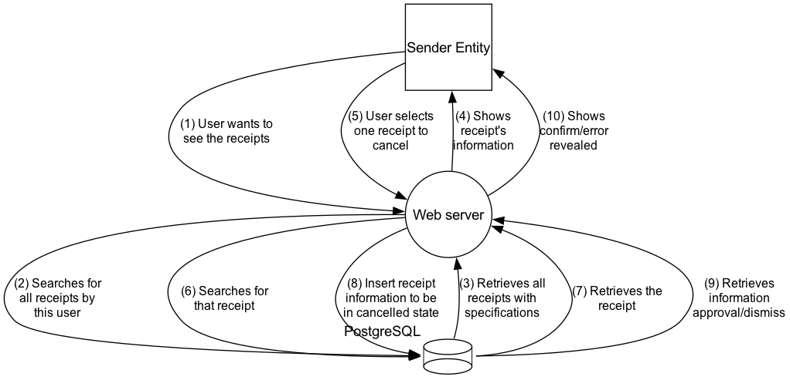
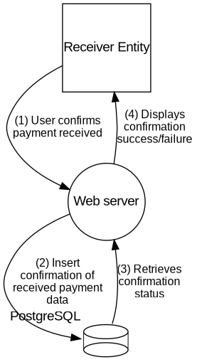
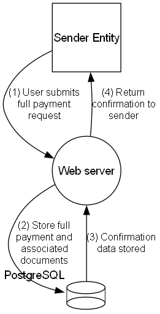
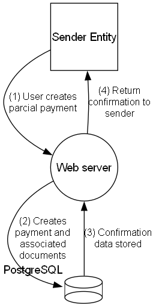
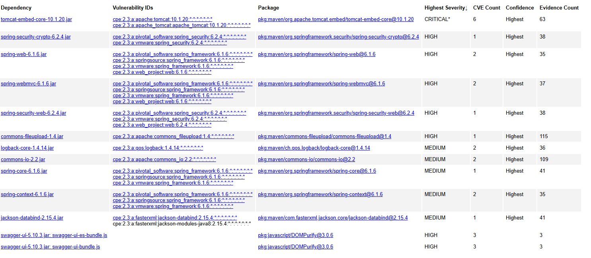

# AnalysisAdd commentMore actions

## Domain Model



This is a brief description of all entities described:

- User has some normal data to have a profile (id, name, nif), an account (email, password, roles) and specific details towards the objective of the application (phoneNumber, bankAccounts);
- It was intended to have at least 3 roles, not counting the administrator although it is defined, a first release of the product won't give more permissions to administrators within the application;
- A PaymentDocument is a document created by a user which will correspond either to nifSender or nifReceiver, and a value to be paid.
- The same person who creates defines its account accordingly, as well as a value and its currency;
- A Payment is generated by the selection of many payment documents and a confirmation of the selection and remaining data;
- It can go from various states depending on the type of user:
- - Pending --> Canceled | Payed (1)
- - Payed --> Confirmed To Be Paid | Pending (2)
- - Confirmed To Be Paid --> Canceled (3)
- A sender can do all the actions except to confirm the payment (2)
- A receiver can do all the actions except to pay (1)
- A payment only corresponds to 2 users, therefore there is only one bank account for each of them defined by the sender.
- Nif has some strict checking, and therefore it was a good idea to define as a separate class to not repeat functions.
- Bank accounts can have many types, although it won't make a difference in the processes developed for now.

All the use cases were developed into the diagram below:

## Use Case Diagram


And from these we can develop many User Stories:

- **US1**: As a guest, I want to log in with my account's personal information
- **US2**: As a guest, I want to register myself in the application. I don't want to register an existing email to my account
- **US3**: As a user, I want to change my personal information. I don't want to change any other user's information
- **US4**: As a user, I want to create a payment. I don't want to create a payment from any entity but myself
- **US5**: As a sender entity, I want to confirm a payment. I don't want to confirm a payment where I am not the sending entity
- **US6**: As an administrator, I want to confirm a payment.
- **US7**: As a receiver entity, I want to confirm a receipt. I don't want to confirm a receipt where I am not the receiving entity
- **US8**: As an administrator, I want to confirm a receipt.
- **US9**: As a receiver entity, I want to reject a receipt. I don't want to reject a receipt where I am not the receiving entity
- **US10**: As an administrator, I want to reject a receipt.
- **US11**: As a sender entity or an administrator, I want to cancel a payment. I don't want to cancel a payment where I am not the sending entity
- **US12**: As a receiver entity or and administrator, I want to cancel a receipt. I don't want to cancel a receipt where I am not the receiving entity

## Non-functional requirements

As for this course, there are many non-functional requirements to be talked about

- **NFR1**: I want the system's database to be backed up every night
- **NFR2**: I want the system to be safe and secure, protected by a firewall
- **NFR3**: I want encrypted information to not be readable in requests
- **NFR4**: I want data to be analyzed and confirmed in the service layer
- **NFR5**: I want logs to put out non-encrypted information
- **NFR6**: I want the application to be easily deployed, especially by GitHub actions
- **NFR7**: I want the system to enforce strong passwords requiring minimum length, character variety (uppercase, lowercase, numbers, symbols), and periodic password updates.
- **NFR8**:  I want the system to block login attempts after several consecutive failed authentication tries, to prevent brute-force attacks.


## Logical Views
In this section we will be looking at different granularity levels of Logical Views of the project we will be designing.
Level 1


Level 2


Level 3


Level 4


## Implementation Views
In this section we will be looking at different granularity levels of Implementations Views of the project we will be designing.
Level 1


Level 2


Level 3


## Physical View

###  Physical View - level 2


## Dataflow

### DFDs

#### Register - level 0


#### Register - level 1


#### Login - level 0


#### Login - level 1


#### Payment cancelation - level 0


#### Payment cancelation - level 1


#### Receipt cancelation - level 0


#### Receipt cancelation - level 1


#### Payment reception confirmation - level 0


#### Payment reception confirmation - level 1


#### Update user info - level 0


#### Update user info - level 1


#### Create Full Payment - lvl 0



#### Create Full Payment - lvl 1


#### Create Partial Payment - lvl 0



#### Create Partial Payment - lvl 1


## Security 

This project incorporates several security measures to protect user data, ensure secure authentication, and prevent common vulnerabilities. The security architecture is built upon the Spring Security framework, employing modern best practices for web applications.

### Authentication and Authorization

Authentication is handled using JSON Web Tokens (JWT), ensuring stateless and secure communication between the client and the server.

- JWT-based Authentication: After a user successfully logs in, the server generates a JWT signed with a strong HMAC-SHA256 algorithm. This token is sent with every subsequent request in the `Authorization` header to authenticate the user.
- Role-Based Access Control (RBAC): The system uses Spring Security to enforce endpoint-level authorization based on user roles (e.g., `SENDERENTITY`, `RECEIVERENTITY`, `ADMIN`). This is configured in the `SecurityConfig` class, ensuring that users can only access resources and perform actions for which they have permission.
- Stateless Sessions: The application is configured with a `SessionCreationPolicy.STATELESS` policy. This means no session information is stored on the server, which enhances scalability and resilience against session-based attacks like session fixation.

### Password Security

To keep user passwords safe, the project follows good security practices:

- **Hashed Passwords**: We never store passwords as plain text. Instead, we use `BCryptPasswordEncoder`, which hashes the password with a random salt. This protects against common attacks like rainbow tables. This helps meet **NFR7**.
- **Strong Password Rules**: We make sure users create strong passwords by checking things like minimum length and different types of characters. This check happens during registration and also supports **NFR7**.

---

### Two-Factor Authentication (2FA)

We use 2FA to make the login process more secure:

- **Email 2FA**: After the user enters their email and password, the system sends a special code to their email.
- **Code Check**: The user must enter this code to finish logging in and get their JWT token.
    - The code expires after **5 minutes** (`app.twofa.code-expiry-minutes=5`)
    - The user only has **3 tries** to enter the right code (`app.twofa.max-attempts=3`)  
      These limits help protect against brute-force attacks on the 2FA code.

---

### Input and Data Validation

To keep data clean and secure, we validate all inputs at the service layer. This helps stop injection attacks and supports **NFR4**.

- **Secure File Uploads**:
    - Only image files are allowed (`image/*`) to stop harmful files from being uploaded.
    - We check that files are only saved in the right directory (no path traversal).
    - Uploaded filenames are cleaned and given a unique name to prevent attacks.

- **Upload Size Limit**: Files can’t be bigger than **5MB** (`spring.servlet.multipart.max-file-size=5MB`). This helps stop Denial-of-Service (DoS) attacks from huge files.

---

### Brute-Force Attack Protection

To stop attackers from guessing passwords, the system keeps track of failed login attempts. This covers **NFR8**.

- **Login Throttling**: We count failed login attempts per user.
- **Account Lockout**: If a user fails too many times (100 tries), their account is locked for **1 hour**. A successful login resets the counter.

---

### Configuration and Secrets Management

- **Secure Settings**: Important settings like JWT secret keys and database passwords are stored in the `application.properties` file, not in the code. This is a best practice for security.
- **JWT Token Security**:
    - The JWT secret is long and random, making it hard to guess.
    - Tokens expire after **24 hours** (`jwt.expiration.ms=86400000`), reducing the risk if one gets stolen.

## Pipeline

To automate integration, security checks, and continuous delivery, a CI/CD pipeline was created using GitHub Actions.
This pipeline runs automatically every time someone pushes code to the main branch.

It has two main jobs:

- build: compile, test and analyze the code

- deploy: put the new version online

### Job: Build

This job makes sure the code is working, safe, and ready to be deployed.
1. Get the Code

It downloads the latest project code from the repository.
```
- name: Checkout code
  uses: actions/checkout@v3
```

2. Set up Java

The pipeline uses Java 17. It prepares the environment for it.
```
- name: Set up JDK 17
  uses: actions/setup-java@v3
  with:
  java-version: '17'
  distribution: 'temurin'
```

3. Build and Test with Maven

This step compiles the code, runs the tests, and creates the .jar file.
```
- name: Maven Clean
  run: mvn clean verify -DskipTests=false -Ddependency-check.skip=true

- name: Maven Compile
  run: mvn compile

- name: Maven Test
  run: mvn test

- name: Maven Package
  run: mvn package
```

4. Check for Vulnerable Dependencies (temporarily disabled)

This step checks if any library used has known security problems.
It's off for now because it needs an API key.
```
- name: OWASP Dependency-Check
  if: false # Temporarily disabled due to NVD API key requirement
  run: mvn org.owasp:dependency-check-maven:check -Dnvd.api.key=${{ secrets.NVD_API_KEY }} -Dnvd.api.delay=3000
```

5. Upload Dependency Check Report

This step would upload the security scan report generated by OWASP Dependency-Check as a build artifact.
It is currently disabled because the Dependency-Check step is skipped due to the missing NVD API key.
```
- name: Upload Dependency-Check report
  if: false
  uses: actions/upload-artifact@v4
  with:
    name: dependency-check-report
    path: target/dependency-check-report.html
```

6. Find Secrets in Code (Gitleaks)

Looks for passwords, API keys, or secrets that may have been accidentally committed.
```
- name: Install Gitleaks
  run: |
  curl -sSL https://github.com/gitleaks/gitleaks/releases/download/v8.24.3/gitleaks_8.24.3_linux_x64.tar.gz | tar xz -C /usr/local/bin

- name: Run Gitleaks to detect secrets
  run: gitleaks detect --source=. --verbose --exit-code=1
```

7. Static Code Analysis (SonarCloud)

Sends the code to SonarCloud, which checks for bugs, bad practices, and security risks.
```
- name: SonarCloud Scan
  uses: SonarSource/sonarcloud-github-action@master
  with:
  args: >
  -Dsonar.projectKey=${{ secrets.SONAR_PROJECT_KEY }}
  -Dsonar.organization=${{ secrets.SONAR_ORGANIZATION }}
  -Dsonar.host.url=https://sonarcloud.io
  -Dsonar.login=${{ secrets.SONAR_TOKEN }}
  -Dsonar.java.binaries=target/classes
  -Dsonar.coverage.jacoco.xmlReportPaths=target/site/jacoco/jacoco.xml
  -Dsonar.exclusions=...
```

8. Save the .jar File

After all checks pass, the compiled .jar file is saved as an artifact for the next job.
```
- name: Upload JAR artifact
  uses: actions/upload-artifact@v4
  with:
  name: app-jar
  path: target/*.jar
```

### Job: Deploy

This job only runs if the build job was successful.
It sends the new version of the app to production.
1. Download the .jar File

Gets the .jar artifact saved earlier.

```
- name: Download JAR artifact
  uses: actions/download-artifact@v4
  with:
  name: app-jar
  path: target/
```

2. Send File to Server

Uses SCP to securely copy the .jar to the virtual machine (VM).
Access is controlled with GitHub Secrets.

```
- name: Copy JAR to VM
  uses: appleboy/scp-action@master
  with:
  host: ${{ secrets.DEPLOY_HOST }}
  username: ${{ secrets.DEPLOY_USERNAME }}
  key: ${{ secrets.DEPLOY_KEY }}
  port: ${{ secrets.DEPLOY_PORT }}
  source: "target/desofs2025_mon_ffs_4-1.0-SNAPSHOT.jar"
  target: "~/desofs_app/"
```

3. Restart the App

Uses SSH to connect to the VM and restart the app using systemctl.

```
- name: Restart service on VM
  uses: appleboy/ssh-action@master
  with:
  host: ${{ secrets.DEPLOY_HOST }}
  username: ${{ secrets.DEPLOY_USERNAME }}
  key: ${{ secrets.DEPLOY_KEY }}
  port: ${{ secrets.DEPLOY_PORT }}
  script: |
  sudo systemctl daemon-reload
  sudo systemctl restart desofs2025
```

4. Check if App is Running

Tries to open the Swagger UI page up to 15 times, waiting 10 seconds between tries.

```
- name: Verify app is reachable externally
  run: |
  for i in {1..15}; do
  curl --fail --silent http://vsgate-http.dei.isep.ipp.pt:10840/swagger-ui/index.html && break
  echo "App not ready yet, retrying in 10 seconds..."
  sleep 10
  done
```

## properties


```properties
# PostgreSQL Connection Properties
spring.datasource.url=jdbc:postgresql://localhost:5432/portal_pagamentos
spring.datasource.username=portal_user
spring.datasource.password=portaL1234!

# Hibernate Configuration
spring.jpa.hibernate.ddl-auto=create-drop
spring.jpa.show-sql=true
spring.jpa.properties.hibernate.format_sql=true
spring.jpa.properties.hibernate.dialect=org.hibernate.dialect.PostgreSQLDialect

# Server Port (optional, default is 8080)
server.port=8080

jwt.secret=bolognese-sauce-secret-asdhauasdhua

jwt.expiration.ms=86400000

spring.servlet.multipart.max-file-size=5MB
spring.servlet.multipart.max-request-size=5MB

# Ensure login page is accessible on startup
spring.security.user.name=admin
spring.security.user.password=admin

# Mailhog
spring.mail.host=localhost
spring.mail.port=1025
spring.mail.username=
spring.mail.password=
spring.mail.properties.mail.smtp.auth=false
spring.mail.properties.mail.smtp.starttls.enable=false

app.email.deliveryMode=mailhog
app.email.mailhog.host=localhost
app.email.mailhog.port=1025
app.email.smtp.host=
app.email.smtp.port=587
app.email.smtp.username=
app.email.smtp.password=
app.twofa.code-expiry-minutes=5
app.twofa.max-attempts=3
```

## Postman

This is how we register in Postman


We also need a different kind of header because of that photo:


The login and 2fa authentication are routes that are only needing application/json headers


And json raw bodies, respectively

```json
{
  "email": "john.doe@example.com",
  "password": "SecurePassword123hasduahsuidhai!"
}
```

```json
{
  "email": "john.doe@example.com",
  "code": "588465"
}
```

## Dependency Checker

To identify potential issues with the project's dependencies, we implemented the OWASP Dependency-Check plugin in the pipeline. Although we successfully generated an API key required for its proper functioning, we encountered configuration issues. As a result, we temporarily skipped full integration into the pipeline, however, the commands needed to execute it are there.
However, we ended up running the dependency checker locally in order to evaluate the application. 
Here's how we ran the dependency checker locally:

```
mvn org.owasp:dependency-check-maven:9.0.9:check 
```

This command generates a detailed report, available at:
target/dependency-check-report.html

After running the command, we got a report with the following results:


This is the results in terms of vulnerabilities, we can see that there are some critical and high vulnerabilities, which we should address in the future.



After analysis, we tried to update the dependencies that were causing the vulnerabilities, but we ended up with some problems, especially related to the tomcat embed core dependency.

However, this ended up result in that really didn't change the vulnerabilities, so we ended up with almost the same report, but with some more information about the dependencies.


Due to the lack of time, we ended up not being able to fix the vulnerabilities, but having a report like this would help us address them in a quicker way, and would help us understand were the application could be lacking in terms of security.

## ASVS progress

To assess the security posture of the application, we also used the OWASP ASVS (Application Security Verification Standard) checklist to validate different aspects of the system. 

This validation provides us with a better overview of where the application might need improvements in terms of security controls and processes.

The validation was summarized in a radar chart, showing the percentage of coverage achieved in each security category, however the full report is in Derivables/ASVS-Sprint-2.zip.

### Project 2 - Sprint 1

This is the progress of the ASVS requirements for this project, in the first sprint.


This was the first result we obtained after the initial validation process:

In this first analysis, we can see that the areas with better coverage were mainly related to Business Logic, Malicious Code, and Error Handling and Logging, while other areas such as Communication and Session Management had a lower coverage percentage.

### Project 2 - Sprint 2

This is the current progress of the ASVS requirements for this project, in the second sprint.

After some iterations, improvements, and further analysis of the application, we produced an updated version of the validation, generating the following result:


By comparing both radar charts, we can see that some areas had slight improvements, especially in API and Web Service, Session Management, and Access Control, while areas like Communication and Data Protection still remained low, indicating that these are areas where we should've further improved.

Although the coverage is still not ideal in some parts, this kind of structured evaluation allowed us to better visualize the application's weaknesses in terms of security, helping guide while we were developing the application.