# DESOFT2025_MON_FFS_4

## Team members

- Leonardo Gomes: 1211239;
- Pedro Alves: 1201416;
- Pedro Coelho: 1240485;

## Sub-topics part 1

This section will have the work distribution between all team members based on the topics defined previously.

### Organization and Language - 5%

- This topic relates to general writing inside the document. Every team member will be participating.

### Analysis - 10%

- Domain Model - 1201416;
- Logical View (levels 1-4) - 1201416
- Implementation View (levels 1-4) - 121139 + 1240485;
- Physical View (level 2) - 1211239 (antes 1212147);

### Dataflow - 15%

- Level 0 and 1 DFDs presented and levels 2+ presented when complexity justifies - 1211239 + 1240485 + 1201416;
- DFDs login e registo - 1240485 (antes 1212147);

### Threat Identification and Analysis - 20%

- Identifies most relevant threats, properly applying STRIDE per element of the DFD - 1211239 + 1240485  + 1201416;
- Details attack vectors and threat agents with abuse cases - 1211239 + 1240485  + 1201416.
- Dos elementos DFDs login e registo - 1240485 (antes 1212147);

### Risk Assessment - 10%

- Employ a well-defined risk assessment methodology to prioritise risks; justifies decisions - 1240485.

### Mitigations - 10%

- Proposes specific, clear and feasible mitigations to threats identified, focusing on high priority ones - 1211239.

### Requirements - 20%

- Security requirements justified, addressing: authentication & access control, data security, communication, input validation and data handling, third-party components, logging and monitoring- 1201416 + 1211239 + 1240485.

### Security Testing - 10%

- Defines security testing methodology - 1240485;
- Defines or refers to abuse cases - 1211239;
- Threat modelling review process - 1201416 (antes 1212147);
- Completeness of ASVS assessment, focusing on architecture - 1201416;
- Traceability between documented security requirements and tests - 1211239 (antes 1212147).

## Analysis

### Domain Model

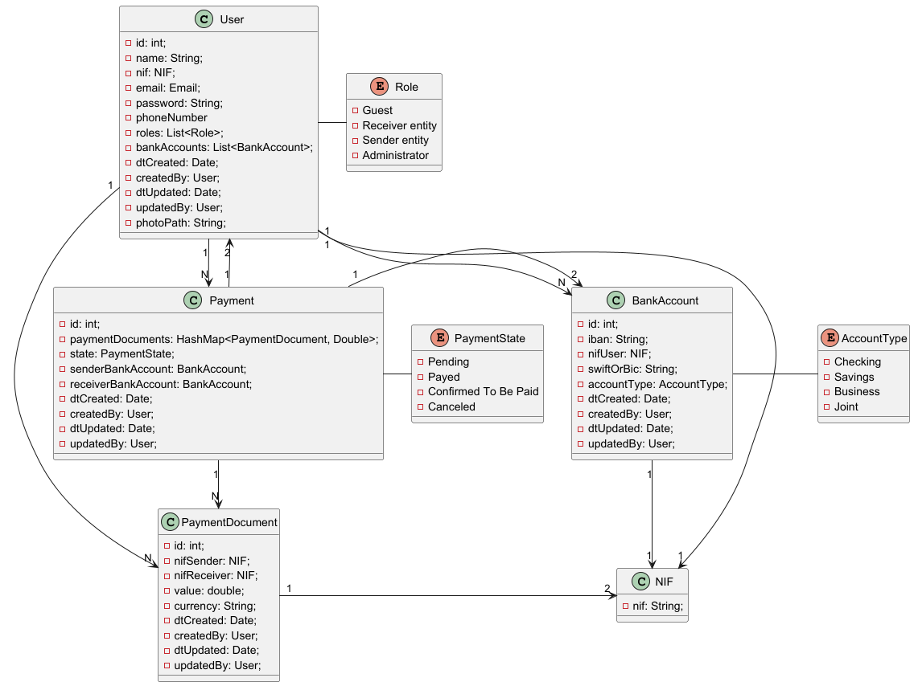

This is a brief description of all entities described:

- User has some normal data to have a profile (id, name, nif), an account (email, password, roles) and specific details towards the objective of the application (phoneNumber, bankAccounts);
- It was intended to have at least 3 roles, not counting the administrator although it is defined, a first release of the product won't give more permissions to administrators within the application;
- A PaymentDocument is a document created by a user which will correspond either to nifSender or nifReceiver, and a value to be paid.
- The same person who creates defines its account accordingly, as well as a value and its currency;
- A Payment is generated by the selection of many payment documents and a confirmation of the selection and remaining data;
- It can go from various states depending on the type of user: 
- - Pending --> Canceled | Payed (1)
- - Payed --> Confirmed To Be Paid | Pending (2)
- - Confirmed To Be Paid --> Canceled (3)
- A sender can do all the actions except to confirm the payment (2)
- A receiver can do all the actions except to pay (1)
- A payment only corresponds to 2 users, therefore there is only one bank account for each of them defined by the sender.
- Nif has some strict checking, and therefore it was a good idea to define as a separate class to not repeat functions.
- Bank accounts can have many types, although it won't make a difference in the processes developed for now.

### Use Cases and User Stories

All the use cases were developed into the diagram below:

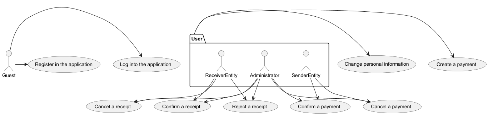

And from these we can develop many User Stories:

- **US1**: As a guest, I want to log in with my account's personal information
- **US2**: As a guest, I want to register myself in the application. I don't want to register an existing email to my account
- **US3**: As a user, I want to change my personal information. I don't want to change any other user's information
- **US4**: As a user, I want to create a payment. I don't want to create a payment from any entity but myself
- **US5**: As a sender entity, I want to confirm a payment. I don't want to confirm a payment where I am not the sending entity
- **US6**: As an administrator, I want to confirm a payment.
- **US7**: As a receiver entity, I want to confirm a receipt. I don't want to confirm a receipt where I am not the receiving entity
- **US8**: As an administrator, I want to confirm a receipt.
- **US9**: As a receiver entity, I want to reject a receipt. I don't want to reject a receipt where I am not the receiving entity
- **US10**: As an administrator, I want to reject a receipt.
- **US11**: As a sender entity or an administrator, I want to cancel a payment. I don't want to cancel a payment where I am not the sending entity
- **US12**: As a receiver entity or and administrator, I want to cancel a receipt. I don't want to cancel a receipt where I am not the receiving entity

### Non-functional requirements

As for this course, there are many non-functional requirements to be talked about

 - **NFR1**: I want the system's database to be backed up every night
 - **NFR2**: I want the system to be safe and secure, protected by a firewall
 - **NFR3**: I want encrypted information to not be readable in requests
 - **NFR4**: I want data to be analyzed and confirmed in the service layer
 - **NFR5**: I want logs to put out non-encrypted information
 - **NFR6**: I want the application to be easily deployed, especially by GitHub actions
 - **NFR7**: I want the system to enforce strong passwords requiring minimum length, character variety (uppercase, lowercase, numbers, symbols), and periodic password updates.
 - **NFR8**:  I want the system to block login attempts after several consecutive failed authentication tries, to prevent brute-force attacks.

### Logical Views
In this section we will be looking at different granularity levels of Logical Views of the project we will be designing.
Level 1

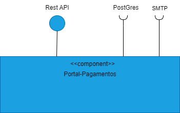

Level 2

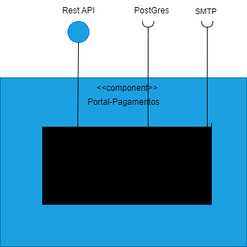

Level 3

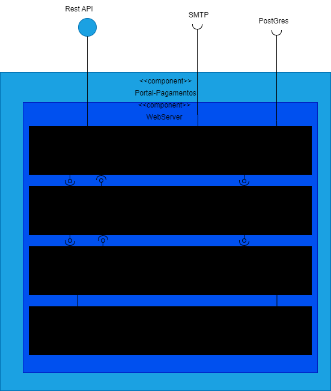

Level 4

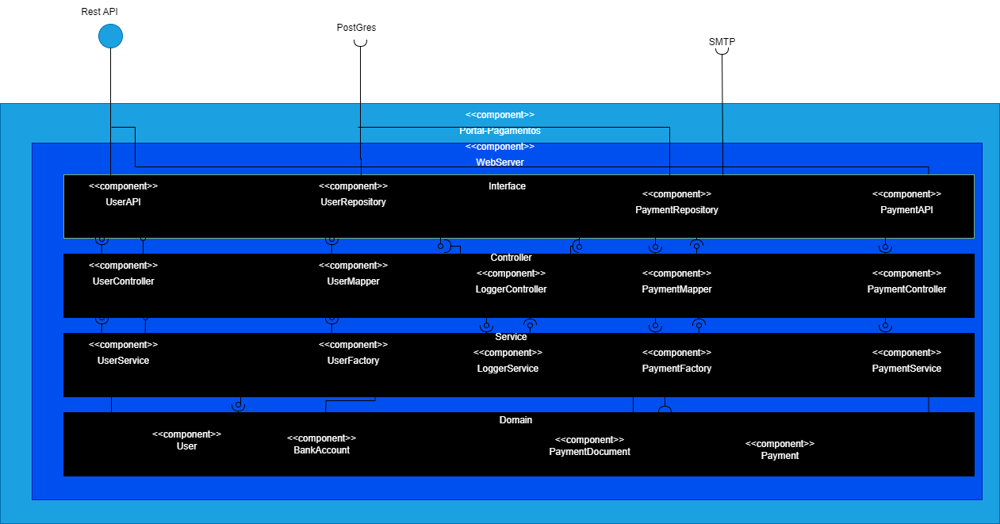

### Implementation Views
In this section we will be looking at different granularity levels of Implementations Views of the project we will be designing.
Level 1

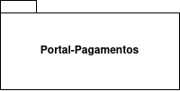

Level 2

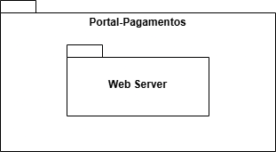

Level 3

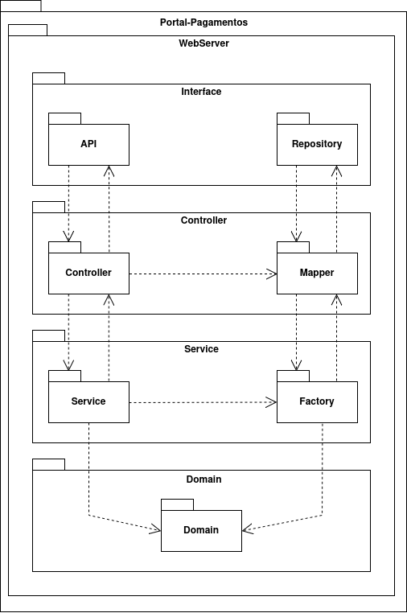

### Physical View

#### Physical View - level 2
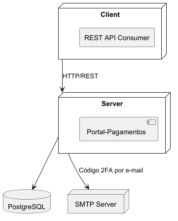

## Dataflow

### DFDs

#### Register - level 0
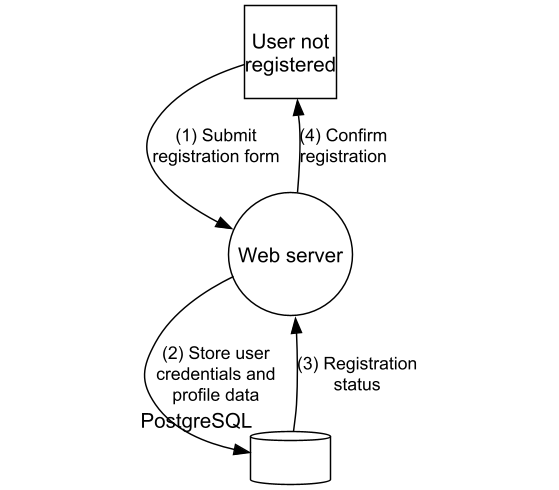

#### Register - level 1
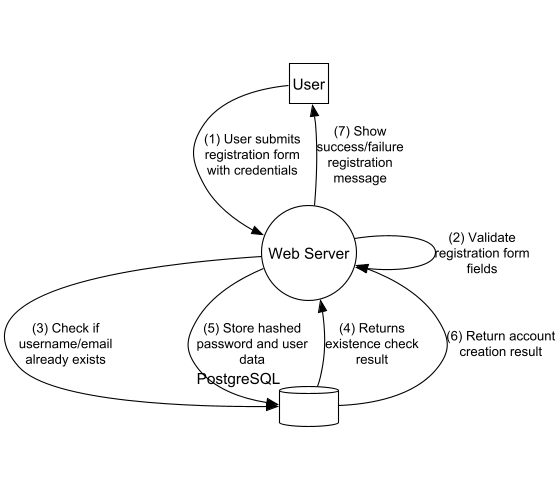

#### Login - level 0
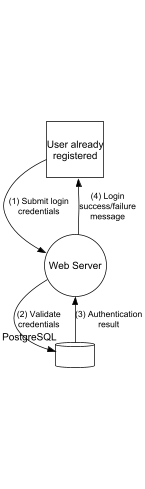

#### Login - level 1
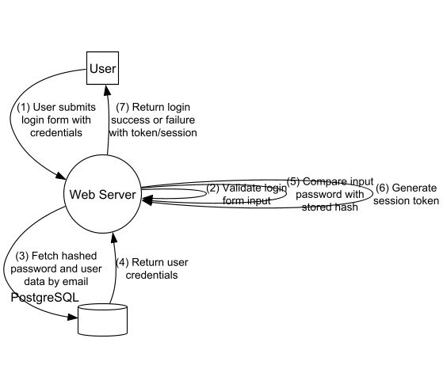

#### Payment cancelation - level 0
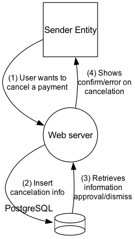

#### Payment cancelation - level 1
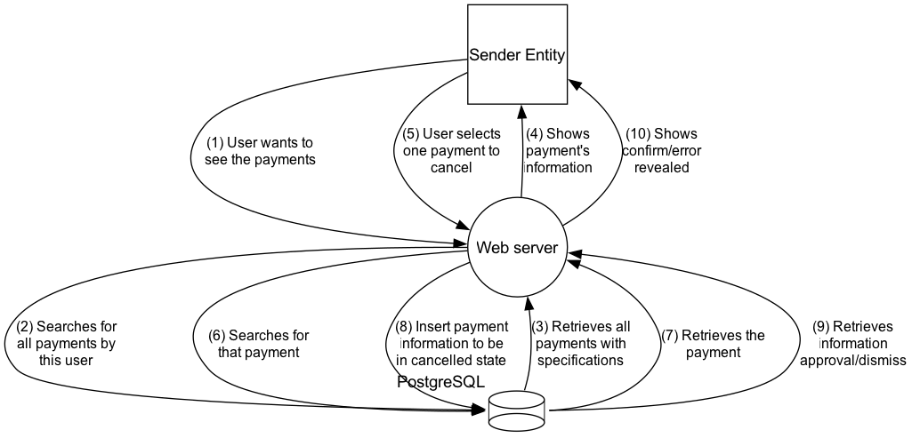

#### Receipt cancelation - level 0
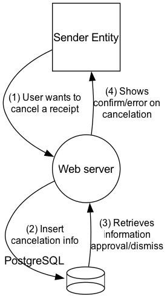

#### Receipt cancelation - level 1
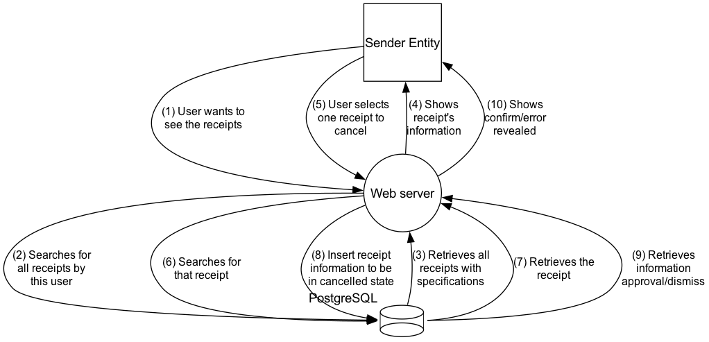

#### Payment reception confirmation - level 0
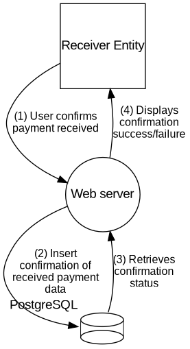

#### Payment reception confirmation - level 1
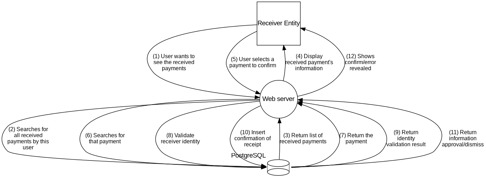

#### Update user info - level 0
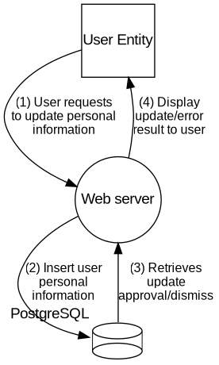

#### Update user info - level 1
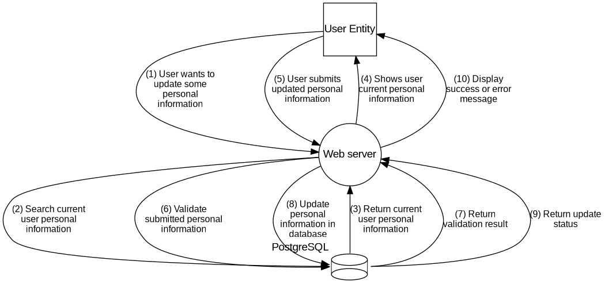

#### Create Full Payment - lvl 0

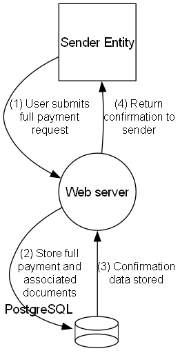

#### Create Full Payment - lvl 1

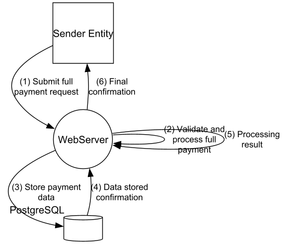

#### Create Partial Payment - lvl 0

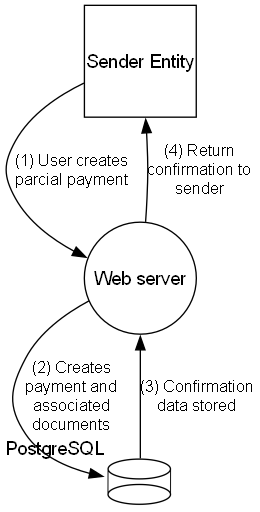

#### Create Partial Payment - lvl 1

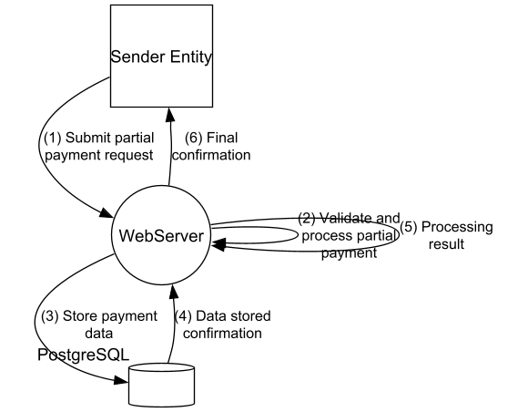

## Threat Identification and Analysis

In this topic there will be a subsection explaining what each point is intended to do and its resolution

### STRIDE analysis

STRIDE analysis is based on using its 6 main points:

- **S**poofing: authenticity of the user or the request.
- **T**ampering: integrity of the disk, memory, etc.
- **R**epudiation: truthness on the given statement.
- **I**nformation Disclosure: confidentiality of the information in the system.
- **D**enial of Service: availability of the needed resources.
- **E**levation of Privilege: authorization to access/updating resources.

#### Payment cancelation

**Sender entity**

- Spoofing: a user may try to impersonate this user.

- Elevation of privilege: there are 2 types of user and only a sender entity can cancel payments.

**Web server**

- Tampering: information altered on the payment affects this user's choosability to cancel them.

- Repudiation: no registration of data being passed between two components.

- Information disclosure: revealing responses (right or error) from the payment's listing or cancellation explicitely.

- Denial of Service: too many requests to these endpoints may lead to conflicts between canceling payments and/or receipts.

- Elevation of Privilege: a faulty system may lead to the update of payments which the user isn't supposed to change.

**Database**

- Tampering: information altered on the payment at the same time may lead to less payments being shown or even the ability to cancel an already canceled payment.

- Repudiation: no logs of the queries or their execution may lead to faulty queries

- Information disclosure: no information on the query's result leads to unfortunate mistakes.

- Denial of Service: two updates at the same time (payment of the same receipt) may lead to conflicts between canceling the same payment.

- Elevation of Privilege: a faulty database may save/update information which is not supposed to save.

#### Receipt cancelation

**Receiver entity**

- Spoofing: a user may try to impersonate this user.

- Elevation of privilege: there are 2 types of user and only a receiver entity can cancel receipts.

**Web server**

- Tampering: information altered on the receipt affects this user's choosability to cancel them.

- Repudiation: no registration of data being passed between two components.

- Information disclosure: revealing responses (right or error) from the receipt's listing or cancellation explicitely.

- Denial of Service: too many requests to these endpoints may lead to conflicts between canceling payments and/or receipts.

- Elevation of Privilege: a faulty system may lead to the update of receipts which the user isn't supposed to change.

**Database**

- Tampering: information altered on the receipt at the same time may lead to less receipts being shown or even the ability to cancel an already canceled receipt.

- Repudiation: no logs of the queries or their execution may lead to faulty queries.

- Information disclosure: no information on the query's result leads to unfortunate mistakes.

- Denial of Service: two updates at the same time (receipt of the same payment) may lead to conflicts between canceling the same receipt.

- Elevation of Privilege: a faulty database may save/update information which is not supposed to save.

#### Payment reception confirmation

**Receiver entity**

- Spoofing: a user may try to impersonate this user.

- Elevation of privilege: there are 2 types of user and only a receiver entity can confirm the payment.

**Web server**

- Tampering: information altered during payment confirmation affects this user's choosability to confirm them.
- Repudiation: lack of detailed registration may result in the inability to trace the origin of a payment confirmation.
- Information disclosure: exposing transaction details can compromise information security.
- Denial of Service: excessive requests to the server can prevent the system from confirming the payment correctly.
- Elevation of Privilege: a faulty system may allow an unauthorized user to confirm the payment.

**Database**

- Tampering: information altered during payment confirmation may lead to the ability to confirm a payment that was already confirmed or without being properly validated.
- Repudiation: lack of an audit log can result in failures to track payment confirmations.
- Information disclosure: lack of information on the query's result can lead to incorrect confirmations.
- Denial of Service: two updates at the same time (payment confirmation) may lead to conflicts between confirming the same payment.
- Elevation of Privilege: a faulty database may allow an unauthorized user to confirm the payment.

#### Update user info

**User entity**

- Spoofing: a user may try to impersonate this user.
- Elevation of privilege: there are 2 types of user and only a user entity can update its information.

**Web server**

- Tampering: information altered on the user during the update process can result in corrupted data or incorrect updates.
- Repudiation: no registration of data being passed between two components.
- Information disclosure: revealing responses (right or error) from the user information update explicitly.
- Denial of Service: excessive requests to the server to update information can result in service failure, preventing legitimate updates.
- Elevation of Privilege: errors in the system may allow an unauthorized user to alter or access another user's personal information.

**Database**

- Tampering: personal information can be corrupted or altered without proper consent.
- Repuditation: lack of an audit log can result in failures to track user information updates.
- Information disclosure: personal data can be exposed due to a lack of adequate database protection.
- Denial of Service: excessive requests to the database can lead to service failure, preventing legitimate updates.
- Elevation of Privilege: database can be configured incorrectly, allowing a user to change data they shouldn't have.

#### Create Payments (Full and Partial)

**User entity**

- Spoofing: A user may attempt to impersonate another user to create a payment.
- Elevation of Privilege: There are two types of users. Unauthorized users attempting to create payments could lead to privilege escalation.

**Web server**

- Tampering: Information altered during payment creation can result in incorrect data being submitted, such as wrong amounts or recipients which can result in wrong amounts being paid.
- Repudiation: If there is no proper record of data being passed between components it may reflect on the difficulty to identify who created the payment and verify the authenticity of the transaction.
- Information Disclosure: Exposing responses, whether correct or error, directly during payment creation can leak sensitive information like amounts, recipient details or account details.
- Denial of Service: Excessive requests to the server to create a new payment can result in service failure.
- Elevation of Privilege: A faulty system might allow a user with insufficient privileges to create or modify payments, bypassing authorization restrictions.

**Database**
- Tampering: Altering data directly in the database could allow a payment to be incorrectly saved.
- Repudiation: The lack of logs or records of transactions in the database might make it difficult to trace who initiated or approved the payment.
- Information Disclosure: Insufficient protection in the database could allow the exposure of payment information, such as amounts or recipient data.
- Denial of Service: Excessive requests to the database may lead to conflicts and prevent payments from being created/updated.
- Elevation of Privilege: Incorrect database configuration might allow unauthorized users to access or modify payment data.

#### Login

**User entity (already registered)**

- Spoofing: an attacker may try to use someone else's credentials to log in.
- Elevation of Privilege: a user might attempt to access restricted areas without proper authorization.

**Web Server**

- **Tampering**: altering data in transit (e.g., credentials) could allow unauthorized access.
- **Repudiation**: lack of proper logging of login attempts can hinder access audits.
- **Information Disclosure**: detailed error messages can reveal if a user exists or if the password is incorrect.
- **Denial of Service**: multiple login attempts (e.g., brute-force attacks) can overload the server.
- **Elevation of Privilege**: system flaws could allow regular users to gain administrative privileges.

**Database**

- **Tampering**: unauthorized modifications to authentication data could compromise user validation.
- **Repudiation**: absence of access logs makes it difficult to trace login attempts.
- **Information Disclosure**: exposure of password hashes or sensitive authentication data.
- **Denial of Service**: simultaneous authentication queries could impact service availability.
- **Elevation of Privilege**: misconfigurations may allow unauthorized access or modification of authentication data.

#### Register

**User entity (not registered)**

- Spoofing: someone could register using another person's data (e.g., email).
- Elevation of Privilege: a user might attempt to register with elevated privileges (e.g., admin role) by modifying the registration payload.

**Web Server**
- Tampering: registration data (e.g., name, email, password) might be maliciously altered before reaching the database.
- Repudiation: lack of logging for account creation makes it harder to trace malicious actions.
- Information Disclosure: detailed error messages during registration may reveal existing users (e.g., "email already in use").
- Denial of Service: automated mass registrations can fill the database or prevent legitimate users from registering.
- Elevation of Privilege: the system could be tricked into creating accounts with higher permissions than allowed.

**Database**

- Tampering: corrupted or unauthorized changes to registration records may affect account integrity.
- Repudiation: no logs of account creations make it difficult to audit and trace issues.
- Information Disclosure: poor permission settings may expose sensitive user data (e.g., email, password).
- Denial of Service: high volumes of registration requests can overwhelm the database.
- Elevation of Privilege: incorrect configuration may allow creation or escalation of privileged accounts.

### Attack vectors

Attack vectors are specific ways a threat actor may gain access to the system to exploit vulnerabilities:

- **Phishing Emails**: commonly known as "scams", malicious links come with many easy ways to detect, like trashy-looking email address, how it is written, etc. and may lead to that person accessing the account of the baited user.

- **Social Engineering Attacks**: our system won't have advanced firewall protections such as Apple or Google, and many hackers are able to do bad to the system

- **Lack of Input Validation**: if form fields are not properly validated or sanitized, they could serve as entry points for injection attacks (e.g., SQL injection).

- **Brute-force Attacks**: repetitive try of combination of user/password using automated scripts

- **Social Engineering**: Attackers may deceive users or admins into revealing credentials or authorizing unintended payments.

- **Denial-of-Service (DoS)**: Flooding the payment creation endpoint with fake requests can slow down or crash the service.

### Threat agents 

Threat agents are the people who can and want to do harm and exploit vulnerabitites to the system:

- **Malicious app users**: a malicious user may register a payment to another user and try to confirm its receipt by accessing the "other user"'s account.

- **Hackers**: our system may be vulnerable to social engineering attacks caused by these hackers.
 
- **External attacker**: may try to obtain non-authorized access by stealing credentials of an account

- **Malicious app users**: may try to exploit failures of the application in order to obtain privileges undeserved

- **Insiders**: with access to the database may attempt to manipulate directly the users data

- **Social Engineers**: Threat agents who manipulate people into divulging confidential information like passwords or authorizations.

### Abuse cases

Abuse cases happen when a malicious user may attack the system:

- **AC01 - As a malicious user, I want to confirm the receipt from another user to my payment**: the intent is simple - to have a registered and approved payment when the payment wasn't actually processed. But the malicious user may try to fool the user by saying he would confirm.

- **AC02 - As a hacker, I want to delete the database information**: our system won't be up and running for the database to be secured by scripted and defined firewalls and, therefore, may be vulnerable to hackers who gain administrator access to the database.

- **AC03 - As a malicious user, I want to update another user's personal information**: by having access to the system's backend or the database directly, the insider can alter data from another user, potentially causing issues related to identity theft or misinformation.

- **AC04 - As a malicious user, I want to confirm the receipt of a payment that I did not receive**: the user’s intention is to falsely mark a payment as confirmed, possibly to speed up a process or create a record of a transaction that was never finalized. This could involve compromising another user's account or exploiting a lack of validation in the confirmation flow.

- **AC05 - As an attacker, I send repeated login attempts with different passwords** in an effort to gain unauthorized access (brute-force attack).

- **AC06 - As an attacker, I use tools to intercept and modify HTTP requests** with intention of attempting to escalate privileges or bypass access controls.

- **AC07 - As a malicious user, I attempt to create a payment using another user's credentials** to redirect funds to my own account.

- **AC08 - As an attacker, I exploit a lack of input validation in the payment form** to perform SQL injection and either extract or modify payment-related data.

- **AC09 - As a malicious user, I repeatedly send create payment requests** to overload the system and prevent others from using the service (DoS).

- **AC10 - As a social engineer, I trick a support staff** into giving me access to another user’s account, so I can initiate payments on their behalf.

- **AC11 - As a malicious insider, I directly edit the database** to inject a fake payment record that was never submitted via the application.
## Risk Assessment

In order to prioritize risks, we will follow the **DREAD** risk assessment model, which focuses on evaluating the impact of different factors related to each threat. 
To determine the ranking of each threat we, as a group, will classify each factor of each threat on a scale of 0-10, where 0 represents low severity and 10 high severity. The factors that will be evaluated are the following:
- **Damage** - How severe would the impact be if the attack succeeded? 
- **Reproducibility** - How easy is it to reproduce the attack?
- **Exploitability** - How much time, effort, and expertise is needed to exploit the threat?
- **Affected Users** - If the threat were exploited, what percentage of users would be affected?
- **Discoverability** - How easy is it for an attacker to discover this threat?

*List of Risks*

| Abuse Case                                                                                 | Damage | Reproducibility | Exploitability | Affected Users | Discoverability | Risk Score |
|--------------------------------------------------------------------------------------------|--------|-----------------|----------------|----------------|-----------------|------------|
| AC01 - As a malicious user, I want to confirm the receipt from another user to my payment  | 8      | 6               | 8              | 7              | 8               | 7.4        |
| AC02 - As a hacker, I want to delete the database information                              | 10     | 3               | 3              | 10             | 3               | 5.8        |
| AC03 - As a malicious user, I want to update another user's personal information           | 9      | 7               | 6              | 1              | 6               | 5.8        |
| AC04 - As a malicious user, I want to confirm the receipt of a payment I did not receive   | 8      | 8               | 6              | 7              | 6               | 7.0        |
| AC05 - As an attacker, I send repeated login attempts with different passwords             | 6      | 10              | 8              | 7              | 10              | 8.2        |
| AC06 - As an attacker, I use tools to intercept and modify HTTP requests                   | 6      | 8               | 5              | 8              | 8               | 7.0        |
| AC07 - As a malicious user, I attempt to create a payment using another user's credentials | 6      | 7               | 6              | 3              | 6               | 5.6        |
| AC08 - As an attacker, I exploit a lack of input validation in the payment form            | 7      | 8               | 7              | 6              | 8               | 7.2        |
| AC09 - As a malicious user, I repeatedly send create payment requests                      | 3      | 10              | 8              | 9              | 8               | 7.6        |
| AC10 - As a social engineer, I trick a support staff                                       | 10     | 3               | 3              | 7              | 5               | 5.6        |
| AC11 - As a malicious insider, I directly edit the database                                | 9      | 3               | 10             | 10             | 6               | 7.6        |

**Justification for each Abuse case**

- AC01 – As a malicious user, I want to confirm the receipt from another user to my payment
  - This case presents a high risk (7.4) due to the significant potential damage (8), the ease of discovery and exploitation, and the number of affected users (7). Strong integrity checks and authentication measures should be applied to prevent fraudulent confirmations.

- AC02 – As a hacker, I want to delete the database information
  - The threat associated with deleting database information is classified as critical (Damage: 10); however, the difficulty of execution (Reproducibility: 3) and the low discoverability (Discoverability: 3) suggest that the overall risk is not as high (5.8) compared to other cases. It remains essential to prioritize database security to mitigate potential threats.

- AC03 – As a malicious user, I want to update another user's personal information
  - Although the potential damage is high (9), the limited number of affected users (1) keeps the risk moderate (5.8). Nonetheless, access control and strong data validation must be enforced to prevent unauthorized modifications.

- AC04 – As a malicious user, I want to confirm the receipt of a payment I did not receive
  - This case represents a significant risk (7.0), though not extreme. The impact on users and moderate exploitability call for strong verification mechanisms and secure identity validation during the confirmation process.

- AC05 – As an attacker, I send repeated login attempts with different passwords
  - This case has the highest risk score (8.2) due to its high reproducibility (10), high exploitability (8), and high discoverability (10). Brute-force prevention mechanisms like rate limiting and CAPTCHA are crucial.

- AC06 – As an attacker, I use tools to intercept and modify HTTP requests
  - This case carries moderate potential damage (6) and a considerable ease of exploitation and discoverability, resulting in a risk of 7.0. HTTPS, server-side validation, and integrity checks are necessary to reduce the threat.

- AC07 – As a malicious user, I attempt to create a payment using another user's credentials
  - While this attack has moderate damage (6) and exploitability, the relatively lower number of affected users (3) reduces the overall risk (5.6). Nonetheless, strong session management and token validation are necessary.

- AC08 – As an attacker, I exploit a lack of input validation in the payment form
  - This abuse case presents a moderate-to-high risk (7.2). The exploitability (7), high discoverability (8), and affected users (6) emphasize the need for input validation on both client and server sides.

- AC09 – As a malicious user, I repeatedly send create payment requests
  - This case results in a high risk (7.6) due to its high reproducibility (10), large number of affected users (9), and the exploitability of the scenario (8). Proper rate-limiting and business logic validation should be enforced.

- AC10 – As a social engineer, I trick a support staff
  - This case has a moderate score (5.6). Despite the high potential damage (10), the attack depends on social interaction, making it harder to reproduce (3). Staff training and secure support protocols are essential countermeasures.

- AC11 – As a malicious insider, I directly edit the database
  - Insider threats are among the most dangerous. This case scores high (7.6) due to critical damage (9), high exploitability (10), and a high number of affected users (10). Strict access control and monitoring are key defenses.

## Mitigations

### High priority

- Logging: the system should log all activities taken by users, especially those related to sensitive operations like payment operations and user information manipulation. This will help in tracking down any malicious activities.
- Input data validation: all inputs should be validated both on the client and server side to prevent injection attacks. This includes validating user information, emails, payment amounts, etc.
- Auth & Access Control: implement authentication mecanisms to ensure that only authorized users can access specific resources and funcionalities.
- Database security: ensure that the database is properly secured, with limited access and strong authentication mechanisms. This includes using prepared statements to prevent SQL injection attacks.
- Rate limiting: implement rate limiting on API endpoints to prevent denial-of-service attacks. This can be done by limiting the number of requests a user can make in a certain time period.
- Secure Session Management: ensure that user sessions are properly managed and secured. This includes using secure cookies, setting session timeouts, and invalidating sessions after logout.
- Error handling: ensure that error messages do not reveal sensitive information about the system or its users. This includes avoiding stack traces and detailed error messages in production environments.

### Medium priority

- Education: educate users about the risks of phishing and social engineering attacks. This can be done through training sessions or informational materials. Additionally, users can be encouraged to use strong passwords and enable two-factor authentication (2FA) for added security.
- Account information: ensure that sensitive user information, such as passwords and bank account details, are stored securely. This can be done by hashing passwords and encrypting sensitive data before storing it in the database.
- Cache Management: ensure that sensitive data is not cached in a way that could be accessed by unauthorized users. This includes using secure caching mechanisms and ensuring that sensitive data is not stored in cache.
- Auditing: implement auditing mechanisms to track changes made to sensitive data. This can be done by logging all changes made to the database and ensuring that these logs are securely stored and monitored.

### Low priority

- Serialization and deserialization of data: ensure that data is properly serialized and deserialized to prevent attacks that exploit vulnerabilities in certain processes. This includes validating the data before deserializing it and using secure libraries for serialization and deserialization.
- Use of Captcha: implement CAPTCHA mechanisms to prevent automated attacks, such as brute force attacks or denial-of-service attacks. This can be done by using CAPTCHA libraries or services that provide CAPTCHA functionality.
- Least privilege principle: ensure that users have the minimum level of access necessary to perform their activities.
- Secure coding practices: ensure that developers follow secure coding practices to prevent vulnerabilities in the code. This includes using secure libraries, avoiding hard-coded credentials, and following best practices for secure coding.

## Security requirements

In this section, the requirements abroad should follow protocols to have a safe system which follows its best practices.

### Authentication & access control

Authentication & access control is extremely important to be safe because some of the information is secret to the user logging in (password). If the data would be transfered in a request, the information would be compromised.

Therefore, some protocols that have to be followed:

- Transport Security: while sending a Rest API request may be dangerous for information leak, there are 2 options to be safe in this department: getting a https certificate or using thymeleaf.org to load an html page for login that assures the data is not sent via a request but inserted directly into the backend - the last one was our choice for choice terms.

- Database security: especially on saving the information, the password can't be a string visible by database accessors ou even hackers - therefore, using bcrypt in our Java backend system works just fine.

- Expirable JWT: a user may be logged in for an hour at most and, whenever accessing the page with the same session during the hour, it doesn't log out unless said so. But even though the person is on the website, after an hour he/she can't perform any actions because his/hers token is not valid now.

- JWT validation: before sending a request, the tokens must be evaluated correctly to verify if that token corresponds to a person with a certain role.

- CORS: Cross-Origin Resource Sharing is a feature built into our system to make sure the webpage and the API are communicating correctly. Although we don't have a webpage, http methods and authorization headers should be attended since we are using a Rest API.

- Logs: log the information to verify wether it's being used correctly, without leaking any crucial information to the user reading them.

### Data security

Since the main focus on this project is to manage finances, there are some aspects to be considered:

- Database Backup: the system is supposed to be up and running at all times even though it will be developed around a localhost. But, at 3:00 am, the database should be backed up and limiting the time to access the app or make any changes.

- Account information: neither the user's login nor the user's bank information should be safe to the user to not be spread. The JWT token usage is already described and therefore all information accessed by that token is only about the payments/receipts/personal that that token is englobated in.

- Invoices/payout records: the registration of payments will be safe from the hands of any user without a direct association to that record

### Communication

Ensuring secure communication between system components and users is fundamental to preserving confidentiality and integrity.

- **HTTPS Protocol**: All communication must occur over HTTPS to prevent man-in-the-middle attacks and data interception.

- **TLS (Transport Layer Security)**: Wherever possible, TLS must be used to encrypt traffic between services, particularly when transmitting sensitive data between the REST API and the Database.

- **Token Confidentiality**: JWT tokens used for authentication must never be exposed via URLs or stored in insecure locations. All tokens are transmitted via the Authorization header, possibly using the Bearer schema.

### Input validation

To prevent common attacks such as SQL injection, XSS, and buffer overflows, all user input must be treated as untrusted and validated accordingly.

- **Server-Side Validation**: All data submitted by users is validated on the backend, regardless of any client-side validations. This includes checking types, formats, length constraints, and required fields.

- **Whitelist Approach**: Input validation follows a whitelist approach, where only explicitly allowed values and formats are accepted. This significantly reduces the risk of malicious input passing through.

- **Error Handling**: Validation errors are logged securely and returned to the user with generic messages to avoid exposing implementation details.

### Data handling

Proper handling of data—especially sensitive or personal data—is critical to ensure security and compliance with best practices.

- **Minimization Principle**: Only the minimum necessary data is collected and processed. This helps reduce the exposure surface in case of data breaches.

- **Encrypted Storage**: Sensitive data such as bank account numbers or payment references are stored in encrypted form within the database.

- **Token-Based Access**: All access to user-related data is scoped via JWT tokens, ensuring users can only access records they are authorized to.

- **Retention Policies**: Data that is no longer needed is regularly purged based on defined retention policies, reducing the window of opportunity for exposure. For example, if a user updates their account number, the previous value is securely deleted from the database to avoid retaining outdated sensitive information.

### Third-party components

- **Dependency Management**: All third-party libraries and dependencies are regularly updated to their latest stable versions to mitigate known vulnerabilities.
- **Vulnerability Scanning**: Regular scans are performed on third-party components to identify and address any known vulnerabilities. Tools like OWASP Dependency-Check can be used for this purpose.
- **License Compliance**: Ensure that all third-party components comply with the project's licensing requirements. This includes checking for any restrictions on usage, distribution, or modification.
- **Security Reviews**: Conduct security reviews of third-party components, especially those that handle sensitive data or perform critical functions. This may include reviewing the source code or documentation for known security practices.

### Logging 
- **Log Levels**: Use appropriate log levels (e.g., DEBUG, INFO, WARN, ERROR) to categorize log messages. Sensitive information should never be logged at any level.
- **Log Rotation**: Implement log rotation to manage log file sizes and ensure that older logs are archived or deleted according to retention policies.
- **Centralized Logging**: Use a centralized logging solution to aggregate logs from different components. This allows for easier monitoring and analysis of logs.
- **Log Integrity**: Ensure that logs are tamper-proof. This can be achieved through cryptographic hashing or using append-only log storage solutions.
- **Access Control**: Restrict access to logs to authorized personnel only. Logs should be stored securely and protected from unauthorized access.

### Monitoring
- **Real-time Monitoring**: Implement real-time monitoring of system components to detect anomalies or suspicious activities. This can include monitoring API requests, database access, and user actions. 
- **Notification Systems**: Set up notification systems to alert administrators of potential security incidents, such as multiple failed login attempts or unusual access patterns.
- **Audit Trails**: Maintain audit trails of critical actions, such as user logins, data modifications, and system changes. This helps in forensic analysis in case of security incidents.
- **Performance Monitoring**: Monitor system performance metrics to identify potential bottlenecks or resource exhaustion that could lead to denial-of-service conditions.

## Security Testing

### Security testing methodology
To ensure the application is secure and resilient against common attack vectors, a structured security testing methodology will be adopted.
We plan to apply at least the following types of security testing:
- Static Application Security Testing (SAST): Review of the source code to detect vulnerabilities like hardcoded credentials, improper validation, etc. 
  - Tools: To verify this we will likely use SonarQube and GitLeaks which is Open-source tool to detect and prevents secret passwords, API/private keys, tokens in source code repositories
- Dynamic Application Security Testing (DAST):
  - Testing the running application to find runtime vulnerabilities such as SQL injection, cross-site scripting (XSS), and insecure authentication flows.
    Tools: To verify this we will likely use OWASP ZAP.
- Authentication & Authorization Testing:
  - Ensures that roles (e.g., sender, receiver, admin) are correctly enforced and that users cannot access unauthorized data.
- Input Validation Testing:
  - Verify that inputs (NIFs, emails, values) are validated both on the client and server side.

### Abuse Case Reference

To address the risks outlined in abuse cases (AC01–AC11), a variety of focused security testing approaches can be applied. Each technique addresses specific vulnerabilities and threat scenarios, ensuring broad protection across the application’s attack surface.

- **Static Application Security Testing (SAST)**  
  Mitigates:
  - **AC02 - Delete database information**
    - Detects insecure coding practices, hardcoded credentials, and improper privilege management.
  - **AC03 - Update another user's personal information**
    - Identifies missing access controls and input validation in the codebase.

- **Dynamic Application Security Testing (DAST)**  
  Mitigates:
  - **AC01 & AC04 - Fraudulent payment receipt confirmation**
    - Detects runtime vulnerabilities in endpoints and insecure confirmation flows.
  - **AC08 - SQL injection through payment form**
    - Identifies injection vectors and improper access control at runtime.

- **Authentication & Authorization Testing**  
  Mitigates:
  - **AC04, AC07 & AC10**
    - Ensures users can only perform actions within their roles, preventing privilege escalation, impersonation, and social engineering exploitation.

- **Input Validation Testing**  
  Mitigates:
  - **AC08 - Input-based SQL injection**
    - Blocks malicious inputs that could compromise application logic or databases.
  - **AC09 - DoS via repeated payment creation requests**
    - Validates and limits input requests to prevent service abuse.

- **Brute-force & Rate-limiting Testing**  
  Mitigates:
  - **AC05 - Repeated login attempts with different passwords**
    - Tests rate limiting, lockout policies, and CAPTCHA enforcement.

- **Security Controls & Session Testing**  
  Mitigates:
  - **AC06 & AC11 - Interception of HTTP requests and direct database edits**
    - Verifies the use of secure communication, session integrity, and strong access restrictions to protect sensitive operations.

#### Conclusion

Applying these testing methods ensures that the most critical threats—those with high DREAD scores—are addressed first, providing a structured defense strategy. Each technique is selected based on the nature and exploitability of the abuse cases it targets, promoting robust security and system resilience.

### Threat modeling review process

This section focuses on evaluating the developed threat modeling, ensuring that the topics such as Threat Identification, Risk Assessment, and Mitigations have been adequately addressed.

The review involves validating various elements, including Data Flow Diagrams (DFDs), STRIDE analysis, abuse cases, mitigations, and security requirements.

**Data Flow Diagrams (DFDs)**

- All necessary DFDs have been developed to meet the application’s needs. The DFDs cover the key processes and data flows required for the system to function as expected.

- Some additional Level 2 DFDs could have been useful to illustrate more granular interactions. Despite this, given that the application is a web server with a straightforward data flow, there is no significant need for more detailed representations, therefore justifying the current level of abstraction.

**STRIDE Analysis**

- Every element from the DFDs has been analyzed using the STRIDE framework, which helps identify threats based on different categories: Spoofing, Tampering, Repudiation, Information Disclosure, Denial of Service (DoS), and Elevation of Privilege.

- The STRIDE analysis has been applied correctly and covers all major threats for each component.

**Abuse Cases**

- The majority of the relevant abuse cases have been discussed and considered. While it is challenging to guarantee that every potential abuse case has been covered, the team has addressed the most common and critical concerns for applications like this one.

- These abuse cases reflect typical attack scenarios that could be exploited, ensuring the model is robust in addressing realistic threats.

**Mitigations**

- A range of mitigations has been proposed to address the identified threats. Given the complexity of potential security issues, only the most significant and feasible mitigations have been highlighted.

- It is not necessary to enumerate every possible mitigation, as some may be highly situational or redundant. Focus has been placed on the most impactful and easily implementable security measures.

**Security Requirements**

- Most security requirements have been addressed, including authentication, access control, data security, and input validation, among others.

- However, some areas may benefit from further exploration, especially in cases where there might be unknown unknowns (for example, new attack vectors or emerging threats). The team has covered standard security practices but should remain vigilant for potential gaps that could arise from unknown vulnerabilities.

### Completeness of ASVS assessment

This topic will be evaluated in terms of the excel given to us, which limits the amount of topics to be analyzed.

Since this is an extensive topic, the whole analysis will be made in the given excel and it must be accessed to write on

### Traceability between Documented Security Requirements and Tests

| Security Requirement                | Description                                                                           | Mitigated Abuse Cases                   | Security Test Type                           |
|-------------------------------------|---------------------------------------------------------------------------------------|-----------------------------------------|----------------------------------------------|
| **Authentication & Access Control** | Enforces identity verification and permissions                                        | AC01, AC04, AC07, AC10                  | Authentication & Authorization Testing       |
| **JWT Validation and Expiry**       | Ensures tokens are valid and time-bound                                               | AC04, AC07                              | Authentication & Authorization Testing       |
| **Input Validation**                | Validates user inputs to avoid injection and malformed data                           | AC03, AC08                              | Input Validation Testing                     |
| **Transport Security **             | Prevents sniffing of credentials or sensitive data in transit                         | AC06                                    | DAST                                         |
| **Database Security  **             | Prevents direct data manipulation or sensitive data exposure                          | AC02, AC03, AC11                        | SAST, Manual Review                          |
| **Logging & Monitoring**            | Records actions and detects abnormal or unauthorized behaviors                        | AC01, AC09, AC11                        | Manual/Tool-Based Monitoring                 |
| **Rate Limiting**                   | Prevents abuse via brute-force and DoS-type attacks                                   | AC05, AC09                              | DAST / Functional Testing                    |
| **Static Code Analysis**            | Detects coding vulnerabilities before deployment                                      | AC02, AC03                              | SAST                                         |
| **Secure Session Management**       | Prevents session hijacking or improper session reuse                                  | AC06, AC10                              | Manual Testing                               |
| **CAPTCHA / Bot Protection**        | Stops automated scripts from abusing endpoints                                        | AC05, AC09                              | Functional Testing                           |
| **User Education & Awareness**      | Prevents exploitation through manipulation or social tactics                          | AC10                                    | N/A (Mitigation via training, not testing)   |
| **Auditing & Change Tracking**      | Ensures traceability of changes made to sensitive records                             | AC03, AC11                              | Manual Inspection / Tool-Assisted Auditing   |
| **Access by Least Privilege**       | Minimizes potential damage by restricting access scopes                               | AC07, AC11                              | Manual Review                                |
